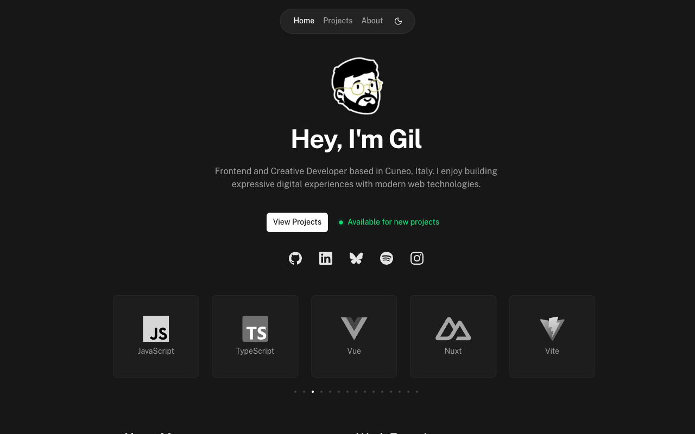
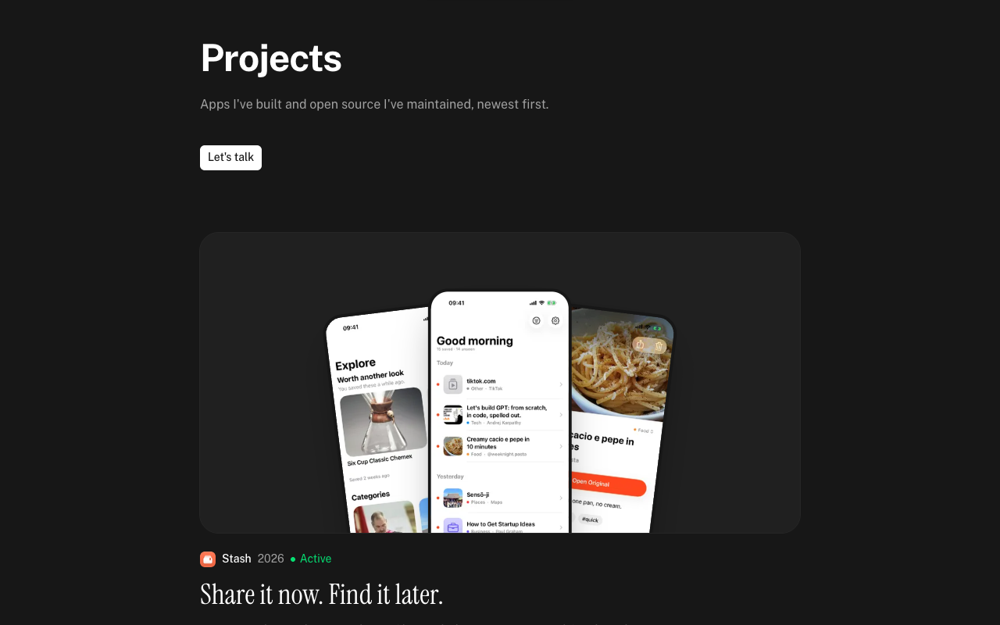

<p align="center">
  
</p>

<h1 align="center">Gil's portfolio</h1>

<p align="center">
  The personal site of Gilbert Ndresaj, a frontend and creative developer in Cuneo, Italy.
</p>

<p align="center">
  <a href="https://g1lg1l.github.io/portfolio/"><strong>g1lg1l.github.io/portfolio</strong></a>
  &nbsp;·&nbsp;
  <a href="https://gilgil.vercel.app">Vercel mirror</a>
</p>

<p align="center">
   
</p>

## What's on it

- **Home:** who I am, where I've worked and the tools I use. The sticker of my face can be grabbed and thrown; it springs back.
- **[Projects](https://g1lg1l.github.io/portfolio/projects/):** the apps I'm building now, shown as a fan of real screenshots that spreads when you hover, then earlier open source work with live GitHub star counts.
- **[About](https://g1lg1l.github.io/portfolio/about/):** the longer story, from GameMaker to Godot.

## Projects

| Project | What it is | Links |
| --- | --- | --- |
| **Stash** | Save-for-later inbox for iPhone: share from any app, find it later | [Source](https://github.com/g1lg1l/stash) |
| **Hackerly** | A calm, keyboard-first reader for Hacker News | [Live](https://hackerly.vercel.app) · [Source](https://github.com/g1lg1l/hackerly) |
| **Vue3 Smooth DnD** | Vue 3 wrapper for the smooth-dnd library | [Source](https://github.com/g1lg1l/vue3-smooth-dnd) |
| **LeafPic** | Open-source Material Design gallery for Android | [Source](https://github.com/UnevenSoftware/LeafPic) |
| **Wappy** | Web WhatsApp chat analyzer | [Source](https://github.com/UnevenSoftware/wappy) |
| **adbFi** | Android app for debugging over Wi-Fi | [Source](https://github.com/g1lg1l/adbFi) |
| **Platform Shooter Demo** | GameMaker Studio 2 platformer demo | [Source](https://github.com/g1lg1l/PlatformShooterDemo) |

## Built with

[Nuxt 4](https://nuxt.com), [Nuxt UI 4](https://ui.nuxt.com), [Nuxt Content 3](https://content.nuxt.com) for the YAML and Markdown content, [Tailwind CSS 4](https://tailwindcss.com) and [motion-v](https://motion.dev/docs/vue) for the animation. Started from the Nuxt UI portfolio template.

## Running locally

Needs Node 22 or later.

```bash
npm install
npm run dev        # http://localhost:3000
npm run build      # production build
npm run lint       # ESLint
npm run typecheck  # vue-tsc
```

## Editing content

Everything on the site lives in [`content/`](content):

- `index.yml`: home page hero, about and work experience
- `about.yml`: About page
- `projects.yml`: Projects page title and intro
- `projects/*.yml`: one file per project. Add `featured: true`, a `tagline` and `screenshots` (images in `public/projects/<slug>/`) to give a project a showcase. Projects with `category: iOS` get the phone fan. `stars: owner/repo` shows the GitHub star count.

The schema for each collection is in [`content.config.ts`](content.config.ts).

## Deployment

Every push to `main` deploys to both:

- **GitHub Pages** (main site) through [`.github/workflows/deploy-pages.yml`](.github/workflows/deploy-pages.yml), served from `/portfolio/`. Canonical and Open Graph URLs point here from both deployments.
- **Vercel** (mirror at [gilgil.vercel.app](https://gilgil.vercel.app)) through the Vercel Git integration. [`vercel.json`](vercel.json) runs `nuxt generate`, so it's plain static files: no functions, and images are resized at build time rather than by Vercel's image optimizer. Web Analytics is only added to Vercel builds.

To check the GitHub Pages build locally:

```bash
NUXT_APP_BASE_URL=/portfolio/ npx nuxt build --preset github_pages
```

## License

[MIT](LICENSE)
